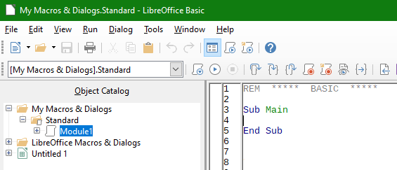

# Save all sheets in separate files

LibreOffice macro to save all the sheets from a spreadsheet in separate files. Filenames are automatically generated from sheets name.

Macro has the following customisation:

- Output format (xls, xlsx, ods or csv)
- Location of the output folder
- Output filename can be further customised

## Installation

Download "CopySheetOut.bas" to your computer, open the file in an editor and copy all its content to clipboard.

Open LibreOffice macro editor: Tools -> Macros -> Edit macros (note: macros must be enabled, this is not the default in LibreOffice!)

Expand: My Macros & Dialogs -> Standard -> Module1

Paste clipboard into Module1. "Sub CopySheetOut()" is created.

## How to use

1. Open the spreadsheet you want to copy sheets from

2. Open the macro editor

3. Scroll to the following section inside "Sub CopySheetOut()"

    <pre>
    ' - * - * - * - * - *
    'Start customisation
    </pre>

4. And change the following variables to fit your requirements:

    <pre>
      Full name of the folder to save the documents to.
      On Windows use / instead of \ to define the folder path.
      Terminate the path with /
         root = "C:/Your/Output/folder/here/"
         loca = "another/sub-folder/"
      We use a special naming convention: root/sheet_name/loca/sheet_name.extn
    
      The output name will be the sheet name with some changes
      An optional suffix for the filename
         suff = ""
    
      Output file format:
         extn = 0   -  0: .xls;  1: .xlsx;  3: .ods;   4: .csv
    </pre>

## Notes

Path separator is / not \ (even on Windows)!

To enabled macros: Tools -> Options... -> LibreOffice -> Security -> Macro Security... -> *select your security model to allow execution of macros (medium is good)*.

## CSV options:

To save in .csv takes an extra parameter: *FilterOptions*

An example is shown below with some options explained:

<pre>
args2(2).Value = "44,34,76,1,,0,false,true,false,false,false"
                   ^ ^  ^  ^  ^  ^     ^    ^    ^     ^-: ?
                   | |  |  |  |  |     |    |    |_______: Save cell formula instead of calculated value, if true
                   | |  |  |  |  |     |    |____________: Save cell content as shown, if true
                   | |  |  |  |  |     |_________________: ?
                   | |  |  |  |  |_______________________: ?
                   | |  |  |  |__________________________: Quote all text cells, if true
                   | |  |  |_____________________________: ?
                   | |  |________________________________: Encoding: 76: utf-8; ANSI: Windows 1252/WInLatin 1; 65535: utf-16
                   | |___________________________________: string delimiter: 34: "; 39: '
                   |_____________________________________: separator: 9: tab; 44: coma; FIX: fixed column width
</pre>

## Licence

This macro is free software: you can redistribute it and/or modify it under the terms of the GNU General Public License as published by the Free Software Foundation, either version 3 of the License, or (at your option) any later version.

This macro is distributed in the hope that it will be useful, but WITHOUT ANY WARRANTY; without even the implied warranty of MERCHANTABILITY or FITNESS FOR A PARTICULAR PURPOSE. See the GNU General Public License for more details.

Copy of the GNU General Public License is availabel at: [http://www.gnu.org/licenses/](http://www.gnu.org/licenses/)

©2019 - GeoProc.com
